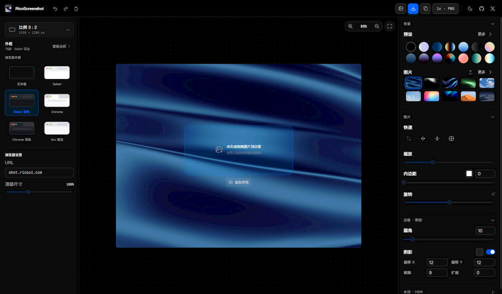

# RicoScreenshot



**在线使用：<https://shot.ricoui.com/>**（纯浏览器端处理，图片不上传服务器）

纯前端（无后端）的截图 / 图片美化编辑器：图片读取、编辑、标注、导出全部在浏览器端完成。既可以作为独立网站运行，也可以打包成 React 组件库供第三方集成。

## 功能特性

- 截图美化：渐变 / 纯色 / 图片背景（[Gradientshub](https://gradientshub.com) 本地精选 + Unsplash 天空 / 宇宙 / 桌面），支持自定义纯色与上传本地图片
- 背景微调：图片模糊 / 遮罩 / 噪点、渐变角度、图片填充方式与九宫格对齐
- 图片标注：矩形、实心矩形、圆圈、直线、箭头、画笔、放大镜、步骤序号、文字、模糊、马赛克、聚光、Emoji 表情
- 底部标注工具栏可一键收起为左下角图标，减少画布干扰
- 截取屏幕：通过浏览器屏幕录制能力直接截取屏幕 / 窗口
- 撤销 / 重做
- 添加水印（支持仅背景水印、HDR 效果）
- 修改尺寸，内置各社媒平台发布的尺寸预设；默认 4:3 画布，拖入截图自动保留比例与背景
- 设备套壳（MacBook / iPhone 等设备边框）、浏览器窗口边框模拟（自定义地址栏 URL 与顶栏尺寸）
- 初始页所见即所得：4:3 画布卡直接预览默认背景与最终效果，支持点击 / 拖拽 / 粘贴导入
- 画布任意缩放和拖拽、适应画布
- 深色 / 浅色主题
- 多格式导出：PNG / JPG / WebP，1x / 2x / 3x 倍率
- 一键复制到剪贴板、快捷键支持

## 快速开始

### 环境要求

- Node.js 18+
- pnpm 9 / 10（仓库声明 `packageManager: pnpm@10.12.1`，推荐用 [corepack](https://nodejs.org/api/corepack.html) 自动匹配版本）

### 安装与启动

```bash
# 启用 corepack 以使用仓库指定的 pnpm 版本（可选）
corepack enable

# 安装依赖
pnpm install

# 启动开发服务器（Vite）
pnpm dev
```

启动后浏览器打开 Vite 输出的地址（默认 <http://localhost:5173>）即可看到编辑器。

### 常用命令

| 命令 | 用途 |
| --- | --- |
| `pnpm dev` | 启动 Vite 开发服务器 |
| `pnpm build` | 构建独立站点，产物在 `dist/` |
| `pnpm build:lib` | 构建 npm ES 模块组件库，产物在 `lib/` |
| `pnpm preview` | 本地预览 `dist/` 构建结果 |
| `pnpm lint` | ESLint 检查 `.js` / `.jsx` |

项目没有后端服务、环境变量和数据库迁移；也没有自动化测试，改动后请至少运行 `pnpm lint` 和对应构建，并做浏览器手工验证（回归清单见 [DOCS/development.md](DOCS/development.md)）。

## 文档

详细文档在 [`DOCS/`](DOCS/README.md) 目录：

- [项目概览](DOCS/project-overview.md)：功能边界、技术栈、目录职责
- [架构与数据流](DOCS/architecture.md)：MobX 状态、LeaferJS 画布、图层与导出链路
- [用户功能](DOCS/user-guide.md)：导入、画布、标注、边框、水印与导出
- [开发指南](DOCS/development.md)：环境、命令、开发约定、回归清单

## 技术栈

- [React 18](https://react.dev/) + [Vite](https://vitejs.dev/)
- [LeaferJS](https://github.com/leaferjs/ui)：画布渲染引擎
- [MobX](https://mobx.js.org/)：状态管理
- [Ant Design 5](https://ant.design/) + [Tailwind CSS](https://tailwindcss.cn/)：UI

## 关于作者

我是 [Rico](https://ricoui.com)，网页/UI 设计师，热衷于做些有趣和创意的作品。拥有 UI/UX 设计工作经验，目前专注于网页设计和视觉落地，以及开发项目探索。

- 博客：[Rico's Blog](https://ricoui.com)
- X（Twitter）：[@ricouii](https://x.com/ricouii)
- 小红书：@Rico的设计漫想
- 微信公众号：Rico的设计漫想

## 致谢与协议

本项目基于开源项目 [image-beautifier](https://github.com/CH563/image-beautifier)（ShotEasy 截图插件内核）二次开发，感谢上游作者 [Chenliwen](https://github.com/CH563) 的工作；上游用于谷歌截图插件 [ShotEasy](https://chromewebstore.google.com/detail/nmppkehciohcgcehlnifgeokgioidknh)。

[MIT License](LICENSE) © Chenliwen（上游）· 二次开发 © [Rico](https://ricoui.com)
